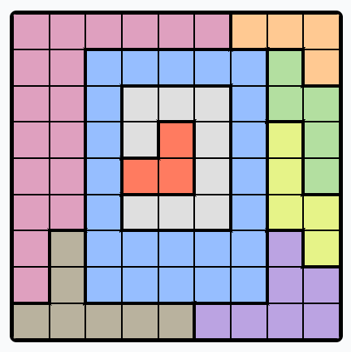
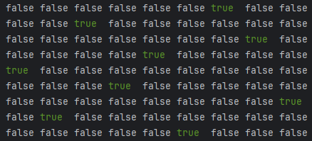

# 👑 Queens Game Solver

Solve custom **Queens placement puzzles** directly from screenshots using **Java + OpenCV**.

  
  
  

---

## 🛠 Features

- 📸 **Select a Screenshot** of a custom Queens board (different colored regions).
- 🧠 **Detects Regions Automatically** using image processing.
- 🎯 **Solves Queens Game** using optimized backtracking algorithm.
- 🎨 **Generates Clean Solution Image** (grid + Queens marked).
- ⚡ **Instant GUI Display** — no need to save or load manually.
- 🎯 Built for **speed**, **simplicity**, and **accuracy**.

---

## 📸 Example Flow

| Problem | Solved Board | Terminal Output |
|:---|:---|:---|
|  |  |  |

---

## 📸 How It Works

1. You take a screenshot of the Queens board.
2. Open the app ➔ Select the image via file picker.
3. The app:
   - Detects the board's outer rectangle.
   - Divides it into a 9x9 grid.
   - Samples center colors to map regions.
   - Solves the Queens puzzle based on constraints:
     - One Queen per row
     - One Queen per column
     - No diagonal attacks
     - One Queen per color region
4. Solution is **instantly shown** in a neat popup window!

---

## 🚀 Tech Stack

| Technology | Purpose |
|:---|:---|
| Java 8 | Core programming |
| OpenCV 4.x (Java bindings) | Image processing |
| Swing (JFileChooser, JFrame) | Minimal GUI |
| Maven | Build and dependency management |

---

## 🚀 Future Scope

- [ ] Handle rotated board screenshots (detect skew, correct perspective).
- [ ] Add option to save solution image to disk.
- [ ] Make board size configurable (e.g., 8x8, 10x10).
- [ ] Bundle OpenCV native DLL inside the JAR for cleaner packaging.
- [ ] Create a full Windows Installer (Setup.exe) for easy distribution.
- [ ] Add "Save As..." option after showing solution popup.
- [ ] Support animated solving (step-by-step queen placement visualization).
- [ ] Build a web-based version (SpringBoot + React).
